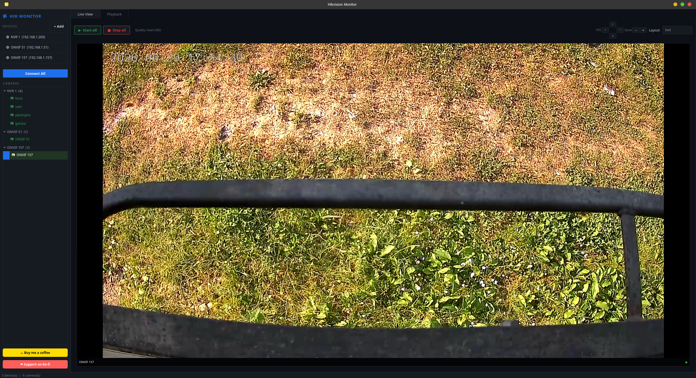

# Hik Monitor

A Linux desktop app for viewing and recording Hikvision, Safire and ONVIF NVR cameras.
I wrote it for my own NVR because iVMS-4200 has no proper Linux build.



## Features

- Live view with 1×1, 2×2, 3×3, 4×4, 1+3 and 1+7 grid layouts
- Recording playback with timeline scrubbing and 0.25×–8× speed
- Multiple NVRs, drag-and-drop cameras into grid cells
- Native Hikvision/Safire (HCNetSDK), generic ONVIF, and manual RTSP
- GPU-accelerated decoding via VAAPI when available
- Dark theme

ONVIF and RTSP cameras work without any SDK. For native Hikvision/Safire devices
the app uses the Hikvision HCNetSDK, which it offers to download on first use.

## Install

### Flatpak (any distro)

Grab `Hik-monitor-x86_64.flatpak` from the [latest release](https://github.com/manutdsnake/Hik-monitor/releases/latest):

```bash
flatpak remote-add --if-not-exists --user flathub https://flathub.org/repo/flathub.flatpakrepo
flatpak install --user ./Hik-monitor-x86_64.flatpak
flatpak run io.github.manutdsnake.Hik-monitor
```

### Debian / Ubuntu

```bash
curl -fsSL https://raw.githubusercontent.com/manutdsnake/Hik-monitor/main/install.sh | bash
```

### Arch / Manjaro

See `packaging/aur/PKGBUILD`.

### From source

```bash
sudo apt install ffmpeg python3 python3-pip python3-venv
git clone https://github.com/manutdsnake/Hik-monitor.git
cd Hik-monitor
pip install PyQt5 requests opencv-python numpy
python3 hik_monitor2.py
```

## Usage

Click **+** in the sidebar to add a device:

- **NVR (Hikvision / Safire)** — IP, port, username, password
- **Scan ONVIF network** — auto-discover ONVIF cameras
- **Manual RTSP URL** — anything else

Click **Save**, then **Connect All**. Cameras appear in the sidebar; click or drag
them into the grid to start streaming.

## Hikvision SDK

Native Hikvision/Safire live view and playback use the Hikvision HCNetSDK
(proprietary, owned by Hikvision). It isn't bundled — when you add such a device,
the app downloads and installs it into `~/.local/share/hik-monitor/sdk`. ONVIF and
RTSP cameras don't need it.

The app looks for the SDK at `HIKVISION_SDK_PATH`, then `~/Desktop/sdk/lib`, then
the auto-install location.

## Tested on

| Device | Status |
|---|---|
| DS-7604NI-K1/4P | Working |
| DS-7608NI-Q1 | Working |
| Safire SF-NVR3104-W (Hikvision-OEM) | Playback |
| O-KAM / generic ONVIF | Working |

Runs on Ubuntu/Kubuntu with AMD and NVIDIA GPUs.

## Notes

This is a personal project. It works for my setup; if something's broken for yours,
open an issue with your NVR model and firmware, or send a PR.

## License

MIT — see [LICENSE](LICENSE). The Hikvision SDK libraries are owned by Hikvision
and remain subject to their own terms.
